# Arquitetura do Sistema

## Visão geral
O **Portfolio Manager** é uma aplicação web baseada em **FastAPI** que permite:
- Criar e administrar carteiras (portfólios)
- Definir classes de ativos e metas por classe
- Importar posições via OCR
- Atualizar preços por múltiplas fontes
- Visualizar dashboards em múltiplos templates

## Componentes principais
- **Backend (FastAPI)**: lógica de negócios, API, autenticação e renderização de templates.
- **Templates HTML (Jinja2)**: dashboards e telas do sistema.
- **Serviços**:
  - `price_service.py`: coleta preços e consenso.
  - `import_service.py`: OCR e parsing de prints.
- **Banco de dados (SQLite)**: persistência de portfólios, classes, ativos e preços.

## Estrutura de pastas
- `app/`
  - `routers/`: rotas HTTP (dashboard, import, assets, etc.)
  - `services/`: serviços externos (preço, OCR)
  - `templates/`: HTML com Jinja2
  - `database.py`: models e conexão
- `data/`
  - `portfoliomanager.db`: banco SQLite
- `var/`
  - `var/.run`: PID, porta e log do Uvicorn
  - `var/logs`: logs do OCR e importações
- `scripts/`
  - manutenção, migrações e utilitários
- `static/`
  - arquivos estáticos

## Fluxo principal
1. Usuário autentica
2. Acessa carteira
3. Ajusta classes e ativos
4. Atualiza preços
5. Visualiza dashboards e relatórios

## Templates de dashboard
O sistema possui **3 templates**:
- **Template 1**: padrão clássico
- **Template 2**: visual mais limpo
- **Template 3**: minimalista com treemap

A escolha pode ser feita por portfólio, dentro do dashboard.

## Onde alterar o quê
- **Tela de login**: `app/templates/login.html`
- **Lista de carteiras**: `app/templates/portfolio_list.html`
- **Configuração de carteira**: `app/templates/portfolio_setup.html`
- **Importação**: `app/templates/portfolio_import.html` + `app/routers/imports.py`
- **Dashboard**:
  - Template 1: `app/templates/dashboard.html`
  - Template 2: `app/templates/dashboard_v2.html`
  - Template 3: `app/templates/dashboard_v3.html`
  - Lógica: `app/routers/dashboard.py`

## Mapa de fluxo (UI → Endpoint → Model)

### Login
- **Tela**: `app/templates/login.html`
- **Ação**: Enviar formulário
- **Endpoint**: `POST /auth/login` (`app/routers/auth.py`)
- **Model**: `User` (`app/database.py`)

### Minhas Carteiras (listar)
- **Tela**: `app/templates/portfolio_list.html`
- **Endpoint**: `GET /portfolios/list` (`app/routers/portfolios.py`)
- **Model**: `Portfolio`

### Criar nova carteira (configuração)
- **Tela**: `app/templates/portfolio_setup.html`
- **Ação**: “Próximo: Selecionar Classes”
- **Endpoint**: `GET /admin/global-classes/` (`app/routers/admin.py`)
- **Model**: `GlobalAssetClass`

- **Ação**: “Criar Portfólio”
- **Endpoint**: `POST /portfolios/` (`app/routers/portfolios.py`)
- **Model**: `Portfolio`

- **Ação**: Salvar classes selecionadas
- **Endpoint**: `POST /asset-classes/` (`app/routers/asset_classes.py`)
- **Model**: `AssetClass`

### Editar carteira
- **Tela**: `app/templates/portfolio_list.html` e `dashboard*.html`
- **Endpoint**: `PUT /portfolios/{id}` (`app/routers/portfolios.py`)
- **Model**: `Portfolio`

### Deletar carteira
- **Tela**: `app/templates/portfolio_list.html`
- **Endpoint**: `DELETE /portfolios/{id}` (`app/routers/portfolios.py`)
- **Model**: `Portfolio` (cascade remove classes e ativos)

### Importar portfólio (OCR)
- **Tela**: `app/templates/portfolio_import.html`
- **Ação**: “Adicionar arquivo”
- **Endpoint**: `POST /imports/preview` (`app/routers/imports.py`)
- **Serviço**: `app/services/import_service.py`
- **Model**: nenhum (pré‑visualização)

- **Ação**: “Confirmar Importação”
- **Endpoint**: `POST /imports/confirm` (`app/routers/imports.py`)
- **Models**: `Portfolio`, `AssetClass`, `Asset`, `PortfolioAsset`

### Dashboard (visão geral)
- **Tela**: `app/templates/dashboard*.html`
- **Endpoint**: `GET /dashboard?portfolio_id=ID` (`app/routers/dashboard.py`)
- **Model**: `Portfolio`, `AssetClass`, `PortfolioAsset`, `Asset`

### Atualizar preços
- **Tela**: `dashboard*.html`
- **Ação**: “Atualizar Preços”
- **Endpoint**: `POST /dashboard/update-prices/{portfolio_id}`
- **Serviço**: `app/services/price_service.py`
- **Model**: `Asset` (last_price, last_price_updated)

### Adicionar ativo
- **Tela**: `dashboard*.html` (modal)
- **Endpoint**: `POST /assets/` + `POST /portfolio-assets/?portfolio_id=ID`
- **Models**: `Asset`, `PortfolioAsset`

### Editar ativo
- **Tela**: `dashboard*.html` (modal)
- **Endpoint**: `PUT /portfolio-assets/{id}`
- **Model**: `PortfolioAsset`

### Remover ativo
- **Tela**: `dashboard*.html`
- **Endpoint**: `DELETE /portfolio-assets/{id}`
- **Model**: `PortfolioAsset`

### Trocar template do dashboard
- **Tela**: `dashboard*.html`
- **Endpoint**: `POST /dashboard/template/{portfolio_id}`
- **Model**: `Portfolio.dashboard_template`

### Administração de usuários
- **Tela**: `app/templates/admin_users.html`
- **Endpoint**: `GET /admin/users` (`app/routers/admin.py`)
- **Ações**:
  - `POST /users/` (criar)
  - `PUT /users/{id}` (editar)
  - `POST /users/{id}/reset-password` (resetar senha)
  - `DELETE /users/{id}` (remover)

## Fluxo de autenticação (JWT)
1. **Login**: `POST /auth/login` gera JWT com `create_access_token`  
2. **Cookie**: token é salvo em `access_token` (httpOnly)  
3. **Middleware/Dependência**: `get_current_user` lê cookie e valida  
4. **Usuário ativo**: `get_current_active_user` garante acesso  
5. **Rotas protegidas**: exigem cookie válido para retornar dados

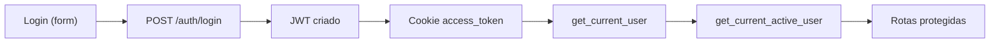

## Fluxo de cálculo de alocação (classe x portfólio)
1. Valor total do portfólio é **fixo** (`Portfolio.total_value`)  
2. Cada classe tem **% meta da classe** (`AssetClass.target_percentage`)  
3. Valor alvo da classe = total_portfólio × % meta  
4. Cada ativo possui **% meta dentro da classe**  
5. % de ativo no portfólio = (% classe no portfólio) × (% ativo na classe)  
6. Cash da classe = valor alvo da classe − valor alocado

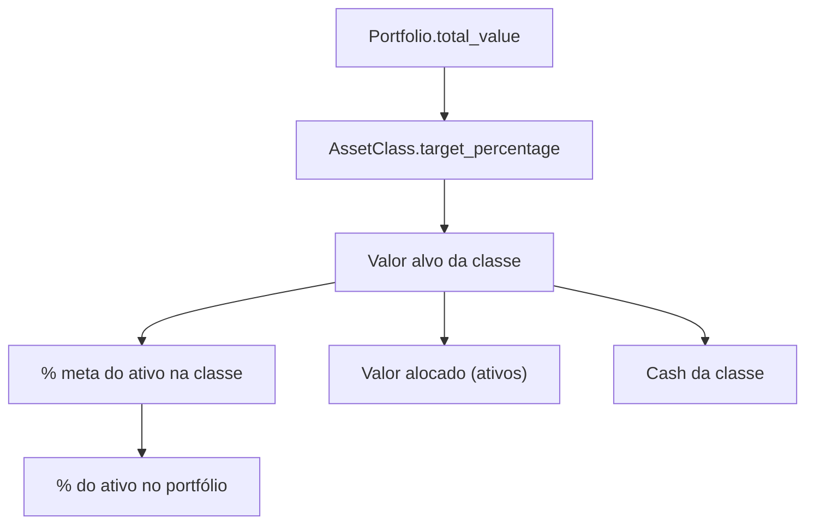

## Fluxo de consenso de preços (multi‑fontes)
1. Ticker é normalizado (ex.: crypto vs ações)  
2. Sistema consulta múltiplas fontes: Finnhub, AlphaVantage, Yahoo, Stooq, CoinGecko, CoinCap  
3. Valores válidos são agregados  
4. Se divergência > limite, retorna status de divergência  
5. Preço final = mediana dos preços válidos  
6. Atualiza `Asset.last_price`, `Asset.last_price_updated`

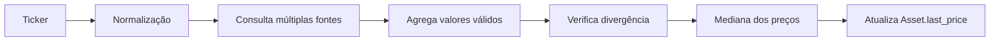

## Fluxo de importação OCR (prints)
1. Usuário escolhe fonte e envia print  
2. OCR extrai texto  
3. Parser identifica ativos/quantidades  
4. Sistema busca preços e valida ticker  
5. Usuário confirma classes e importação  
6. Ativos e posições são salvos

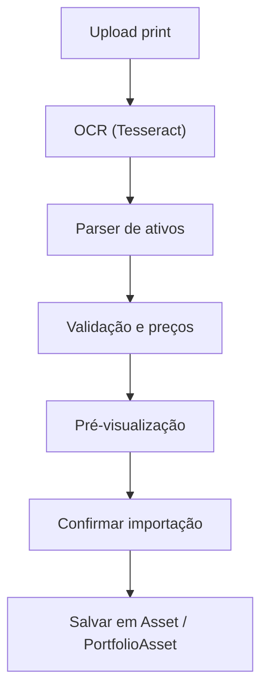

## Fluxo de criação de portfólio (configuração)
1. Usuário preenche dados básicos  
2. Seleciona classes globais  
3. Define % meta por classe  
4. Sistema cria portfólio e classes

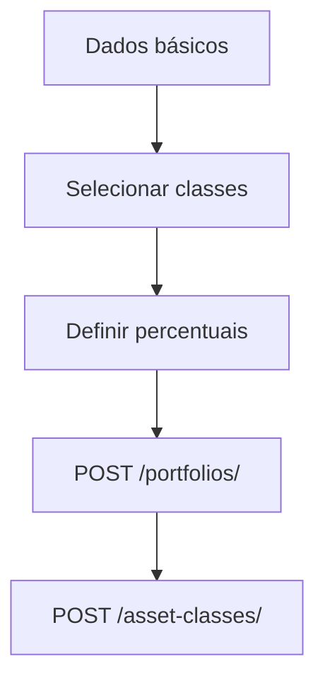

## Fluxo completo de atualização de preços
1. Usuário clica "Atualizar Preços"  
2. Sistema lista ativos do portfólio  
3. Para cada ativo, busca consenso multi‑fontes  
4. Atualiza preço e timestamp  
5. Retorna status para UI

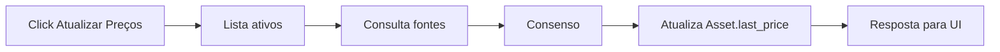

## Fluxo de rebalanceamento e desvio
1. Calcula % atual (classe e portfólio)  
2. Compara com % meta  
3. Calcula desvio  
4. Define status (OK / sub‑alocado / sobre‑alocado)  
5. Sugere comprar/vender

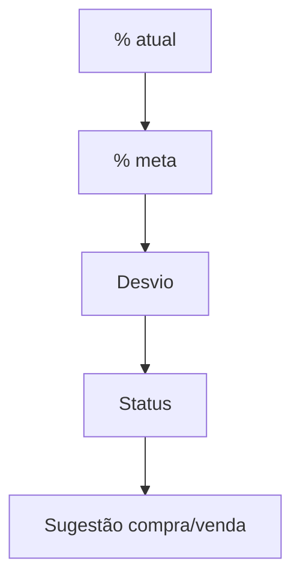

## Fluxo de classes globais x customizadas
1. Sistema carrega classes globais  
2. Usuário seleciona ou cria classe custom  
3. Classe custom é vinculada ao portfólio  
4. Mapeamentos ficam salvos para importações futuras

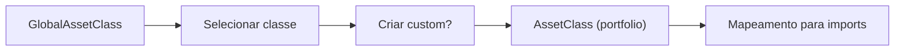

## Fluxo de migração de template
1. Usuário escolhe template no dashboard  
2. Front envia `POST /dashboard/template/{portfolio_id}`  
3. Portfólio salva preferência  
4. Próximos acessos carregam o template escolhido

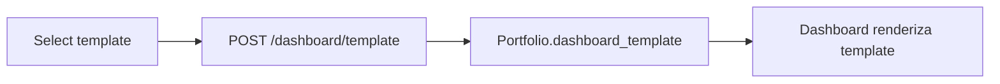

## Fluxo de OCR + validação de moeda
1. OCR extrai texto do print  
2. Parser identifica sinais monetários  
3. Sistema sugere moeda  
4. Usuário confirma ou escolhe outra  
5. Preços são buscados na moeda confirmada

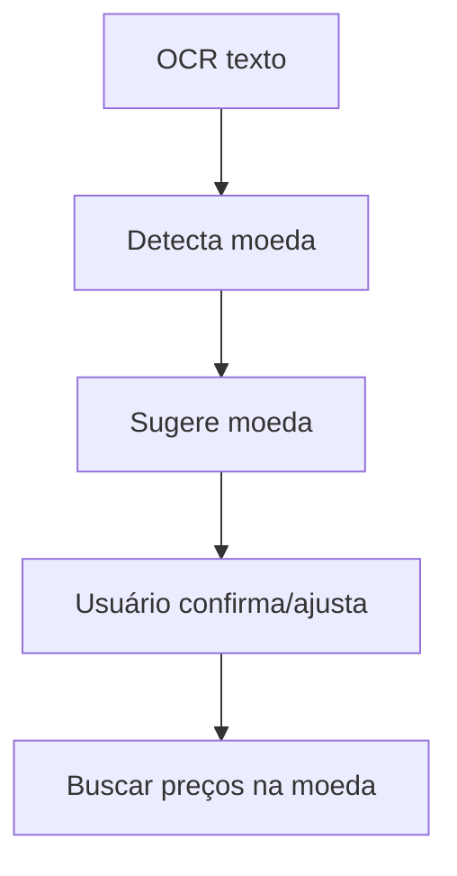

## Fluxo de criação/promover admin
1. Executa script `create_admin.py`  
2. Usuário é criado (ou promovido)  
3. Flag `is_admin` marcada

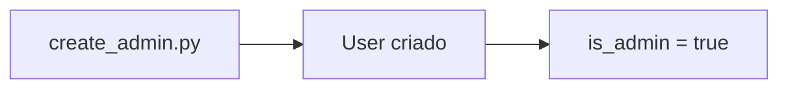

## Fluxo de exportação futura (CSV/Excel)
1. Usuário solicita exportação  
2. Sistema lê ativos e posições  
3. Gera arquivo CSV/Excel  
4. Usuário baixa o arquivo

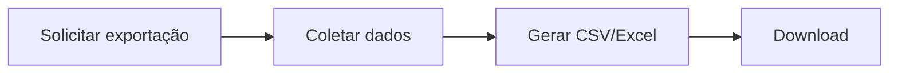
